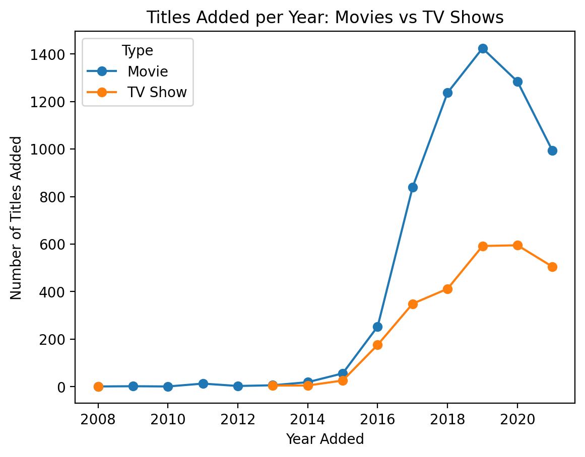
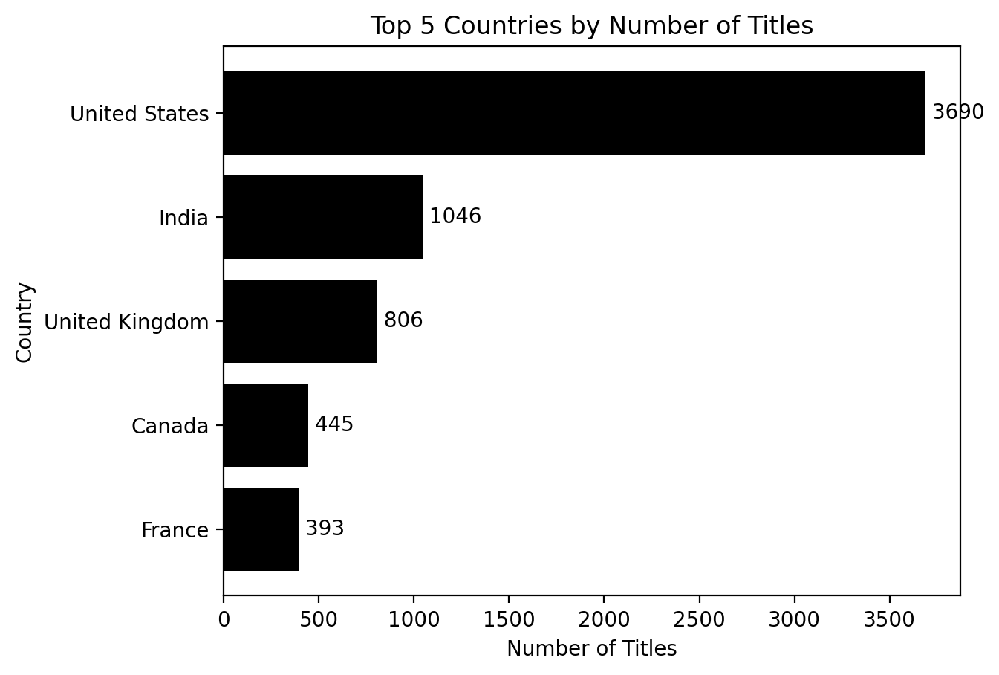
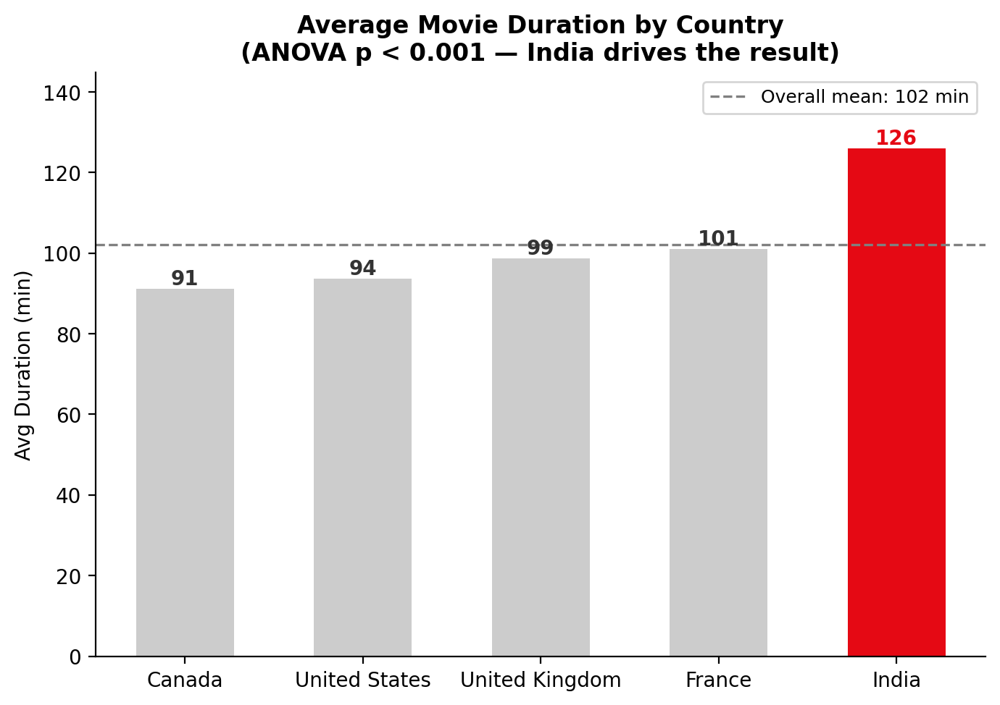
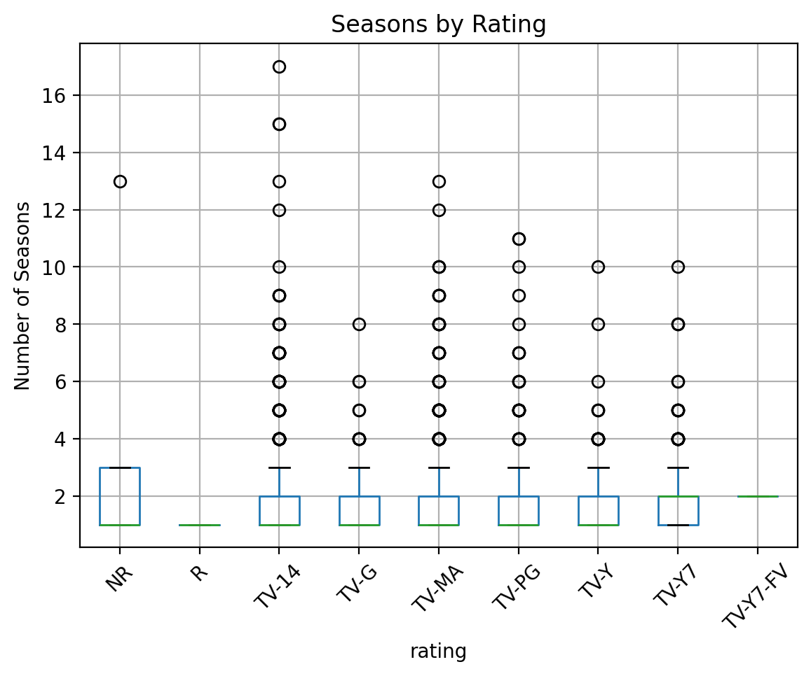
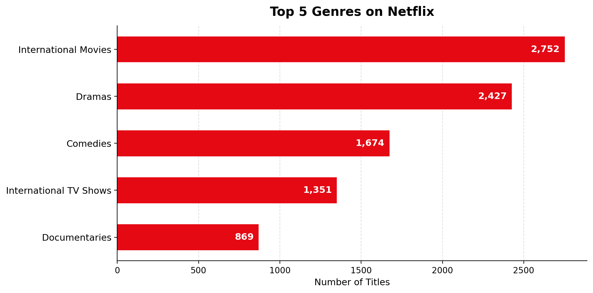
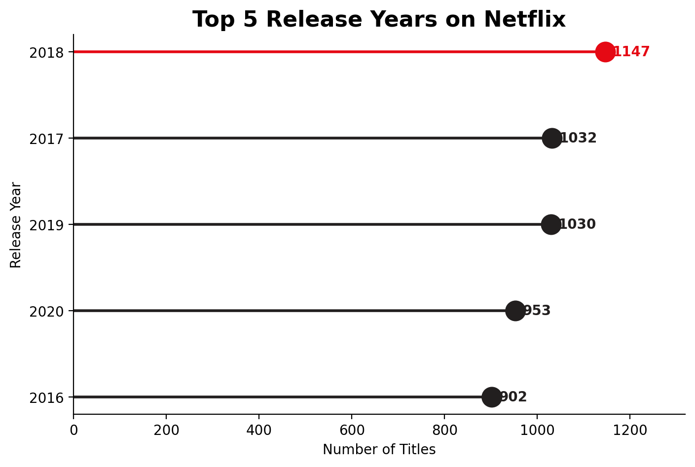
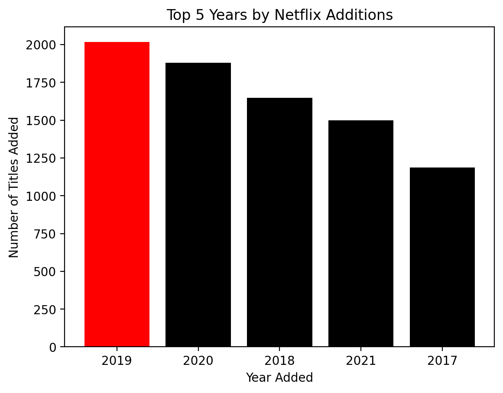
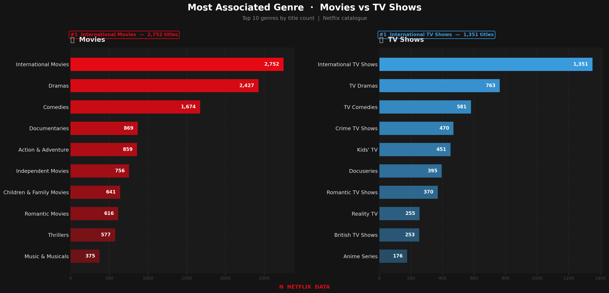

# Netflix-EDA
"Exploratory Data Analysis on Netflix titles dataset"

# Exploring Netflix: A Data-Driven Look at 8,807 Titles

## 🔑 Key Insights (TL;DR)

**1. Content Explosion Post-2015**
Netflix's content additions grew sharply from 2015 onward, with Movie additions consistently outpacing TV Shows by roughly 2x at peak volume (2019: ~1,420 Movies vs. ~590 TV Shows). Both categories show an apparent decline after 2019; note that 2021 data is incomplete (covering only through September 25, 2021), so this trailing dip should not be read as a confirmed slowdown.



---

**2. India's Outsized Market Presence**
The US dominates Netflix's catalog with 3,690 titles, but the more telling signal is India's outsized presence at 1,046 — nearly 3x the UK (806) and 7x France (393). Among non-US markets, India stands alone as Netflix's single largest content bet, reflecting deliberate investment in South Asian audiences.



---

**3. Indian Cinema Runs Significantly Longer**
An ANOVA test confirmed a statistically significant difference in average movie duration across the top 5 movie-producing countries (F = 312.29, p < 0.001). India is the clear outlier, with an average runtime of ~126 minutes — roughly 25–35 minutes longer than Canada, the UK, the US, and France, which cluster closely between 91–101 minutes. This is consistent with known conventions in Indian cinema, where longer runtimes are common.



---

**4. Rating Has a Modest but Real Effect on TV Show Longevity**
A one-way ANOVA reveals a statistically significant relationship between TV Show rating and number of seasons (F = 2.47, p = 0.012), though the effect size is modest — most ratings share similar median season counts of 1–2. The relationship is driven less by mature content systematically running longer, and more by a handful of long-running outlier series (15+ seasons) concentrated in the TV-14 category. Across all rating categories, the median TV show on Netflix runs just 1–2 seasons, suggesting Netflix's catalog skews heavily toward shorter-run content regardless of audience rating.



---

## 📌 Problem Statement

I wanted to explore Netflix's content library and find out what the data actually says — which countries dominate, which genres lead, and are there any patterns that aren't obvious at first glance?

---

## 📊 Dataset

- **Source:** Kaggle — Netflix Movies and TV Shows
  (https://www.kaggle.com/datasets/shivamb/netflix-shows)
- **Size:** 8,807 rows × 12 columns (raw)
- **Time range:** 2008–2021 (date_added); content as old as 1925
- **Key fields:** `type`, `title`, `director`, `cast`, `country`, `date_added`, `release_year`, `rating`, `duration`, `listed_in`

---

## 🛠️ Approach / Methodology

- **Data cleaning:** Fixed a shifted-row bug where `duration` values were sitting in the `rating` column for 3 rows; converted `date_added` from plain text to datetime and extracted `year_added`
- **Feature engineering:** Parsed multi-value columns (`director`, `cast`, `country`, `listed_in`) using a `split()` → `explode()` → `strip()` pipeline; engineered `duration_mins` and `number_of_seasons` via regex, split by content type
- **Statistical methods:** One-way ANOVA (scipy) applied twice — movie duration across top 5 countries, and number of seasons across TV rating categories

---

## 🧹 Data Cleaning & Preparation

The raw dataset (8,807 titles, 12 columns) required several rounds of cleaning before analysis — both fixing genuine data errors and engineering reusable features.

**Data quality fixes**
- **Shifted-row bug:** 3 rows had `duration` values incorrectly sitting in the `rating` column (e.g. `"74 min"` appearing where a rating like `"TV-MA"` was expected). Identified and corrected at the source before any further processing.
- **Datetime conversion:** `date_added` was stored as plain text; converted to proper `datetime` objects via `pd.to_datetime()`, then used to derive a clean `year_added` column with `.dt.year`.

**Parsing multi-value columns**
Several columns (`director`, `cast`, `country`, `listed_in`) stored multiple comma-separated values in a single cell — e.g. `"Raúl Campos, Jan Suter"` as one director field, or `"United Kingdom, Canada, United States"` as one country field. Left as-is, these collapse distinct entities into a single combined string, undercounting or misattributing individual values.

Each was split and exploded into one value per row using a consistent `split()` → `explode()` → `strip()` pipeline, applied at the point of use rather than permanently overwriting the original columns — preserving the one-row-per-title structure of the main dataset while enabling accurate per-entity counts (e.g. individual director title counts, true top-genre rankings, per-country breakdowns).

**Derived numeric columns, split by content type**
The `duration` column meant different things for Movies (`"90 min"`) vs. TV Shows (`"1 Season"` / `"5 Seasons"`) — a single shared column would have meant mixing minutes and seasons. Two clean, type-specific numeric columns were engineered instead:
- `duration_mins` — extracted via regex for Movies only; `NaN` for TV Shows
- `number_of_seasons` — extracted via regex for TV Shows only; `NaN` for Movies

**Missing values**
Missingness was handled deliberately, not blanket-dropped. Genuine data corrections (the rating/duration shift, datetime parsing) were applied permanently to the dataset. For columns with natural missingness (`director`, `cast`, `country`), `.dropna(subset=[...])` is scoped inline at the point of each specific analysis, rather than removing rows from the dataset wholesale — preserving as much usable data as possible for questions that don't depend on those fields.

**Final shape:** `(8807, 17)` — one row per title, with original columns intact alongside the engineered features above. Remaining missingness in `director`, `cast`, and `country` reflects genuine gaps in Netflix's source metadata, not a cleaning oversight.

---

## 📈 Visualizations

### Top 5 Genres on Netflix


### Top 5 Release Years on Netflix


### Top 5 Years by Netflix Additions


### Most Associated Genre: Movies vs TV Shows


---

## ✅ Results & Conclusions

Starting this project, I had no specific hypothesis — just curiosity about what Netflix's catalog actually looks like beneath the surface. The data told a clearer story than expected.

Netflix's content library was largely flat until 2015, then grew aggressively — movies consistently outpacing TV Shows by roughly 2x at peak. India emerged as a standout finding across two separate analyses: it's Netflix's largest non-US content market by volume, and its movies run ~25–35 minutes longer than every other top-5 country — a difference confirmed statistically via ANOVA (p < 0.001).

Working with a real, messy dataset also taught me that cleaning decisions matter as much as analysis — how you handle multi-value columns, missing data, and type-mixed fields directly shapes the quality of every insight that follows.

---

## ⚠️ Limitations

- **Incomplete 2021 data:** The dataset was collected on September 25, 2021, meaning 2021 figures cover only ~9 months. The apparent post-2019 decline in content additions should not be read as a confirmed trend without a full-year dataset.
- **Genre tag limitation:** The `listed_in` column contains Netflix's own internal genre tags, not standardized industry categories. A title tagged 'International Movies' tells us how Netflix classified it, but reveals nothing about actual genre — making genre comparisons partially dependent on Netflix's own tagging decisions rather than objective content categorization.

---

## 💻 Tech Stack & How to Run

**Libraries:** pandas, numpy, matplotlib, scipy

```bash
# Install dependencies
pip install -r requirements.txt

# Launch notebook
jupyter notebook notebooks/netflix_eda.ipynb
```

---

## 📁 Repo Structure

```
Netflix-EDA/
├── data/
│   ├── netflix_data.csv
│   └── netflix_cleaned.csv
├── notebooks/
│   └── netflix_eda.ipynb
├── images/
├── README.md
└── requirements.txt
```

---

*Dataset source: [Netflix Movies and TV Shows](https://www.kaggle.com/datasets/shivamb/netflix-shows) by Shivam Bansal on Kaggle*

